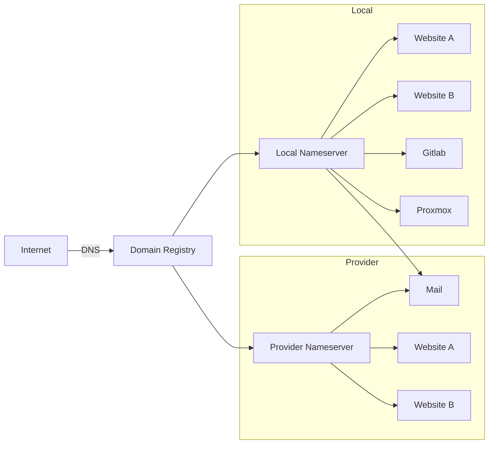
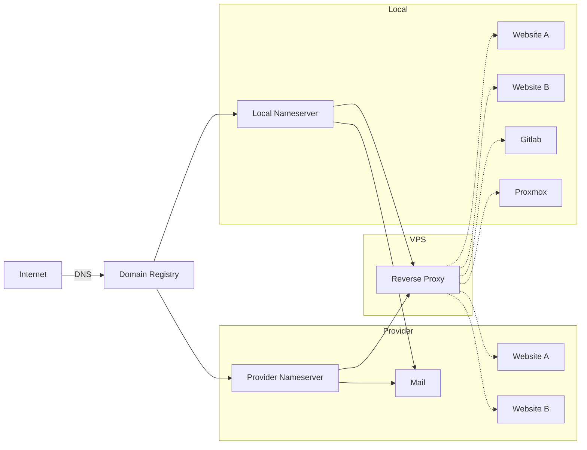
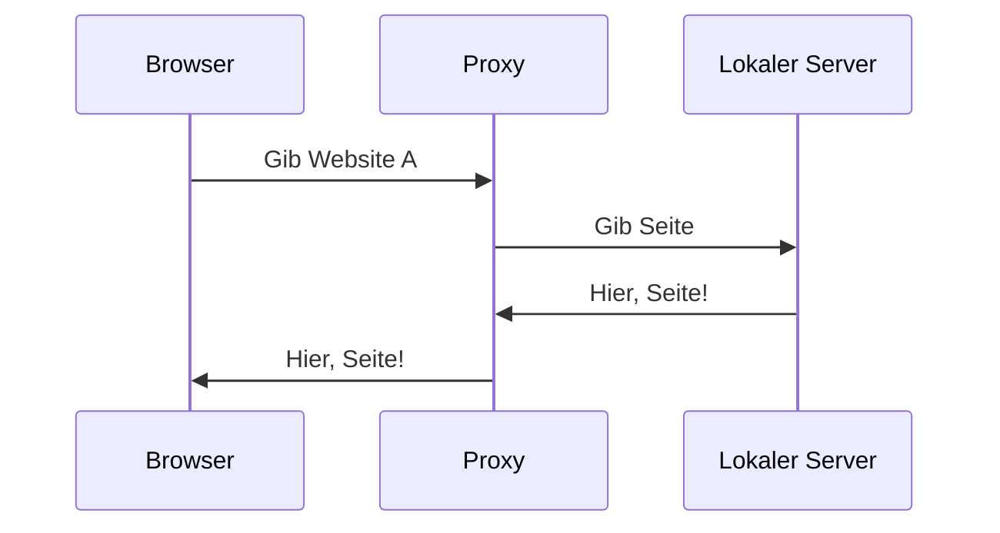
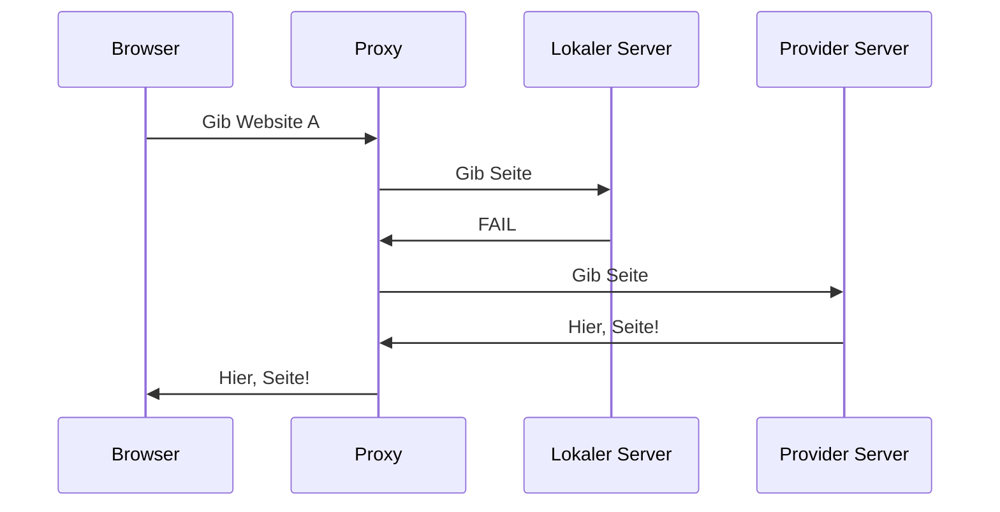
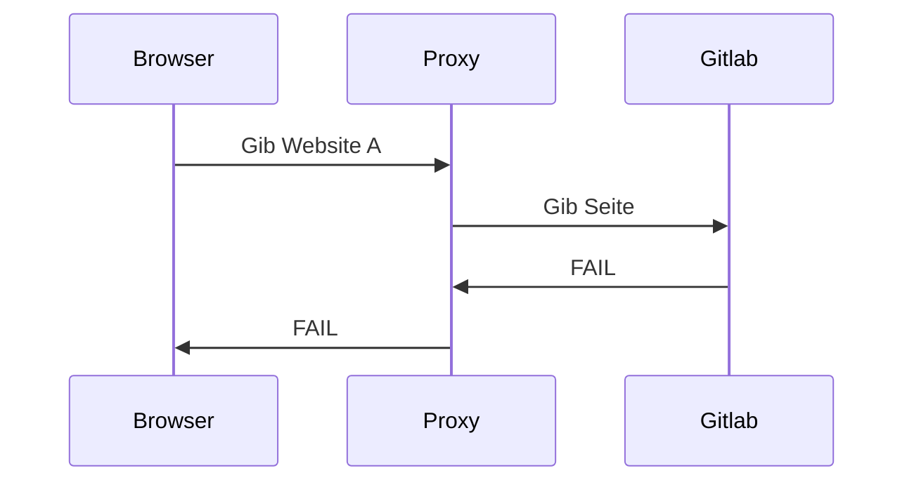

# Home Cluster Domain Setup

## Pure DNS Basis

### Vorteile

- Braucht keinen VPS

### Nachteil

- Du kannst keinen Fallback für lokale Dienste machen, die sich nicht einfach synchronisieren lassen
- Du weißt nie, ob eine Anfrage an Website A lokal oder beim Provider geschickt wird
- DNS TTL

## Reverse Proxy

### DNS

### HTTP(S)

#### Lokaler Server OK

#### Lokaler Server nicht OK

#### Exklusiv Lokaler Server nicht OK

### Vorteile

- Du hast Kontrolle wo Aufrufe hin gehen
- Du kannst Fallback Seiten für lokale Dienste erstellen

### Nachteil

- VPS Kosten
- ALLE Anfragen gehen komplett durch den reverse proxy (heißt auch Anfragen aus deinem Netzwerk gehen erst ins Internet)